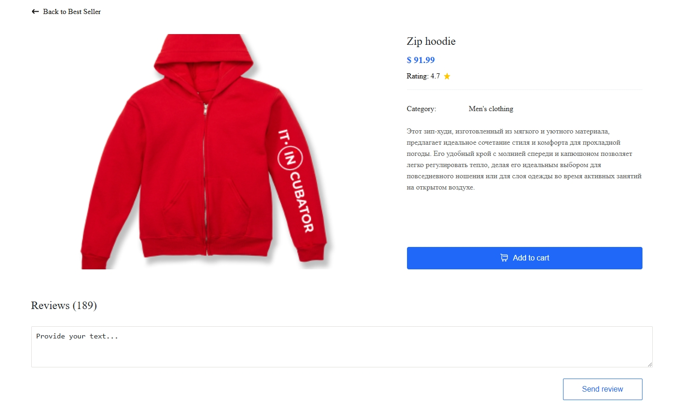

# Дом. задание: Вводное занятие по React 1️⃣Реализация отзывов

### 1️⃣Реализация отзывов

**Проделав данное домашнее задание вы закрепите:**

* создание компонент
* работа с массивом данных
* работа с `useState`
* работа с `map`
* работа с объектом события `event`

1\) ⚡Создайте новый компонент **Reviews** и отрисуйте его в компоненте **Product.tsx**

```
export const Reviews = () => {
  return (
    <div className="review">
      <h3>Reviews (189)</h3>
      <textarea placeholder="Provide your text..."></textarea>
      <button>Send review</button>
    </div>
  );
};
```

```
export const Product = () => {
  /*...*/

  return (
    <>
     /*...*/
      <Reviews />
    </>
  );
};
```

**Результат**



2\) ⚡Для того чтобы сделать сам блок с отзывом нам нужны данные (кто оставил отзыв, какой, когда и т.д.).

1. Создайте массив с первоначальным данными в компоненте **Reviews**
2. Напишите типизацию Review
3. Отрисуйте отзывы при помощи метода map

```
import { useState } from "react";
import avatarIcon from "./assets/img/avatarIcon.svg";

type Review = {
  // самостоятельно
};

export const Reviews = () => {
  const [reviews, setReviews] = useState<Review[]>([
    {
      author: "Jane Cooper",
      title: "Amazing Product",
      text: "Lorem Ipsum is simply dummy text",
      date: "01/01/2021",
      rating: 4,
    },
    {
      author: "Max Doodle",
      title: "Best choice",
      text: "Various versions have evolved over the years",
      date: "05/23/2021",
      rating: 5,
    },
  ]);

  return (
    <div>
      <div className="review">
        <h3>Reviews (189)</h3>
        <textarea placeholder="Provide your text..."></textarea>
        <button>Send review</button>
      </div>
      <div>
        {reviews.map((r) => {
          return (
            <div className="reviewField">
              <div className="info">
                <div className="user">
                  
                  <div className="infoBox">
                    <p className="author">{r.author}</p>
                    <p className="rating">{r.rating} Rating</p>
                  </div>
                </div>
                <div>
                  <p className="date">{r.date}</p>
                </div>
              </div>

              <div className="content">
                <p className="title">{r.title}</p>
                <p>{r.text}</p>
              </div>
            </div>
          );
        })}
      </div>
    </div>
  );
};
```

Как результат получим поле добавление отзывы 2 стартовых отзыва на странице 💪


4\) ⚡Обработка событий Теперь давайте научимся создавать новый отзыв и отрисовывать его. Для начала нам нужно сохранять данные которые мы вводим в поле.

Для это нам понадобится еще один стейт. Но возникает вопрос как нам вытянуть из поля символы которые мы вводим. Для решения данной задачи существует несколько решений. Рассмотрим самый популярный, работа с объектом события

* создадим еще один state для хранения введенного значения
* повесим обработчик события onChange на textarea
* считываем значения из объекта события (event) и сетаем в стейт

```
export const Reviews = () => {
  /*...*/

  const [currentReview, setCurrentReview] = useState("");

  const currentReviewHandler = (e: ChangeEvent<HTMLTextAreaElement>) => {
    const newValue = e.currentTarget.value;
    setCurrentReview(newValue);
  };

  return (
    <div>
      <div className="review">
        <h3>Reviews (189)</h3>
        <textarea
          value={currentReview}
          placeholder="Provide your text..."
          onChange={currentReviewHandler}
        ></textarea>
        <button>Send review</button>
      </div>
      /*...*/
    </div>
  );
};
```

**Результат**


5\) ⚡Теперь делаем добавление отзывов в стейт

* повесьте обработчик события onClick на кнопку Send review
* напишем функцию, которая будет добавлять отзыв

```
export const Reviews = () => {
  /*...*/

  const addReviewHandler = () => {
    const newReview = {
      author: "Jane Cooper",
      title: "Amazing Product",
      text: currentReview,
      date: "05/23/2021",
      rating: 5,
    };
    setReviews([newReview, ...reviews]);
  };

  return (
    <div>
      <div className="review">
        <h3>Reviews (189)</h3>
        <textarea
          value={currentReview}
          placeholder="Provide your text..."
          onChange={currentReviewHandler}
        ></textarea>
        <button onClick={addReviewHandler}>Send review</button>
      </div>
      /*...*/
    </div>
  );
};
```

Проверяем. Вводим отзыв, нажимаем на кнопку Send Review и видим как отзыв добавляется 💪


6\) ⚡Сделаем пару маленьких улучшений.

1. После ввода нажатия на кнопку добавления нужно сделать зануление текста в роле отзыва

```
const addReviewHandler = () => {
    const newReview = {
      author: "Jane Cooper",
      title: "Amazing Product",
      text: currentReview,
      date: "05/23/2021",
      rating: 5,
    };
    setReviews([newReview, ...reviews]);
    setCurrentReview("");
  };
```


2\. Давайте научимся подсчитывать реальное количество отзывов и отобразим эту информация вместо захардкодженной цифры 189

```
<h3>Reviews ({reviews.length})</h3>
```


Надеюсь у вас получилось выполнить 2 эти задачи. Это еще одна маленькая победа 🚀

Last updated 6 months ago
