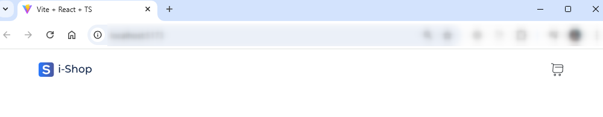

# It-incubator shop 2️⃣Главная страница

### 2️⃣Главная страница


* **Компонент** - это функция или объект(классовая компонента), принимающая props и возвращающая разметку (JSX).
* **Компонент** - это тег.
* **Компоненты** являются строительными блоками пользовательского интерфейса приложения React. Эти компоненты разделяют весь пользовательский интерфейс на маленькие независимые и многократно используемые части

❗Внутри компонента только один корневой элемент

2\) ⚡Знакомство с **JSX**

* **JSX** — это расширение синтаксиса JavaScript, которое позволяет использовать похожий на HTML синтаксис для описания структуры интерфейса.
* **JSX** обладает всей мощью JavaScript. В **JSX** вы можете использовать любые JavaScript-выражения внутри фигурных скобок. Каждый React-элемент является JavaScript-объектом, который можно сохранить в переменную или использовать внутри программы.
* После компиляции каждое **JSX-выражение** становится обычным вызовом JavaScript-функции, результат которого — объект JavaScript.

3\) ⚡ Создадим компонент **Header**

💡В этом примере показываем как работать с картинками в React

Подключение **картинок** assets/img

```typescript
import logo from './assets/img/logo.svg'

export const Header = () => {
  return (
    <div className="header">
	
    </div>
  )
}
```

По аналогии подключите иконку для корзины (cart.svg)

**Итоговый результат 🚀**

<figure><figcaption></figcaption></figure>

4\) ⚡ Создадим еще один компонент **BestSellers**

* При отрисовке карточек с товарами отрисуем захардкодженные данные

```typescript
export const BestSellers = () => {

  const products = [
    {
      _id: "664476983793ba7564c50ba2",
      id: 8,
      title: "Zip hoodie",
      price: 91.99,
      description: "Этот зип-худи, изготовленный из мягкого и уютного материала, предлагает идеальное сочетание стиля и комфорта для прохладной погоды. Его удобный крой с молнией спереди и капюшоном позволяет легко регулировать тепло, делая его идеальным выбором для повседневного ношения или для слоя одежды во время активных занятий на открытом воздухе.",
      category: "men's clothing",
      image: "https://production-it-incubator.s3.eu-central-1.amazonaws.com/file-manager/Image/e12cebe8-7d13-4842-98ab-f71e0df6a2f4_8-zip-hoodie.png",
      rating: {
        rate: 4.7,
        count: 120
      },
      createdAt: "2024-05-15T08:47:20.180Z",
      updatedAt: "2024-05-15T12:20:34.117Z",
      __v: 0
    }
  ];

  return (
    <div className="card">
      
      <h4>{products[0].title}</h4>
      <p className="price">${products[0].price}</p>
      <button>Show more</button>
    </div>
  );
};
```

Как итог на экране вы должны увидеть карточку 🚀

<div align="left"><figure><figcaption></figcaption></figure></div>

5\) ⚡ А если у нас 2 карточки ?

* добавим в массив еще один элемент (скопировать 0 элемент массива и заменить в нем **title, price**)
* в разметке напишем код для отрисовки 2 товара

Как итог на экране вы должны увидеть 2 карточки 💪

Хм...🤔 А если у нас 100 карточек ? И это вполне себе реальность, а не фантазия ) Что тогда делать, постоянно дублировать код ???

❗ Дублирование кода - грех №1 в программировании 😈

Чтобы избавиться от дублирования кода применим метод массива [**map**](https://developer.mozilla.org/ru/docs/Web/JavaScript/Reference/Global_Objects/Array/map)

```typescript
export const BestSellers = () => {

  /*...*/

  return (
    <div className="bestSeller">
      <h2>Bestsellers</h2>
      <div className="cards">
        {
          products.map((pr) => {
            return (
              <div className="card">
                
                <h4>{pr.title}</h4>
                <p className="price">${pr.price}</p>
                <button>Show more</button>
              </div>
            );
          })
        }
      </div>
    </div>
  );
};
```

💡 Вот таким вот образом мы избавились от дублирования кода

6\) ⚡ Теперь вместо захардкодженных данных давайте сделаем реальный запрос на сервер

```
https://masterclass.kimitsu.it-incubator.io/api/products
```

6.1) Просто так в компоненте обращаться к серверу нельзя, т.к. мы будем нарушать концепцию React. Для запросов на сервер сегодня используется хук [**`useEffect`**](https://react.dev/reference/react/useEffect)

```typescript
useEffect(() => {
    axios.get("https://masterclass.kimitsu.it-incubator.io/api/products")
       .then((res) => {
          const products = res.data;
        });
}, []);
```

Поставим debugger и убедимся что к нам пришли реальные данные с севера 💪

6.2) Теперь нам нужно отрисовать каким то образом данные. Для этого нам понадобится еще один хук [**`useState`**](https://react.dev/reference/react/useState)

```typescript
const [products, setProducts] = useState([])

useEffect(() => {
    axios.get("https://masterclass.kimitsu.it-incubator.io/api/products")
      .then((res) => {
        const products = res.data;
        setProducts(products)
      });
}, []);
```

6.3 ) Чтобы Typescript не ругался создадим новый тип и протипизируем `useState`

```typescript

import axios from "axios";
import { useEffect, useState } from "react";

export type Product = {
  _id: string;
  id: number;
  title: string;
  price: number;
  description: string;
  category: string;
  image: string;
  rating: {
    rate: number;
    count: number;
  };
  createdAt: string;
  updatedAt: string;
  __v: number;
};

export const BestSellers = () => {

  const [products, setProducts] = useState<Product[]>([]);

  useEffect(() => {
    axios.get("https://masterclass.kimitsu.it-incubator.io/api/products")
      .then((res) => {
        const products = res.data;
        setProducts(products);
      });
  }, []);

  /*...*/
};
```

Если вы все сделали правильно, то на экране увидим отрисованные товары пришедшие с сервера 🚀

<figure><figcaption></figcaption></figure>

